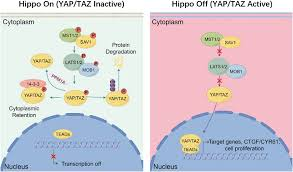

YAP/TAZ/TEAD4 ChIP-Seq Reanalysis

Overview:

This project reproduces and extends the **YAP/TAZ/TEAD4 ChIP-seq analysis** from Zanconato et al. (2015) to understand how transcriptional co-activators **YAP** and **TAZ** cooperate with **TEAD4** and **AP-1** to regulate oncogenic gene expression in breast cancer.  

Using publicly available ChIP-seq datasets, this analysis explores **genome-wide binding patterns**, **enhancer–promoter classification**, and **motif enrichment** to confirm enhancer-centric regulation by the Hippo signaling pathway.


Biological Context:
The Hippo Signaling Pathway:



The **Hippo pathway** is a signaling network that controls organ size, cell proliferation, and apoptosis.  
When active, Hippo phosphorylates and inactivates the effector proteins **YAP** (Yes-associated protein) and **TAZ** (Transcriptional co-activator with PDZ-binding motif), retaining them in the cytoplasm.  

When **Hippo is inactive**, YAP and TAZ translocate to the nucleus and bind to **TEAD1–4** transcription factors on chromatin. This interaction turns on growth-promoting genes such as **CTGF**, **CYR61**, and **BIRC5**, driving cell proliferation and tumor growth.

In breast cancer, **overexpression or nuclear accumulation of YAP/TAZ** is associated with:
- Enhanced proliferation  
- Metastatic potential  
- Resistance to therapy  
- Poor prognosis  

The Role of TEAD and AP-1:

- **TEAD transcription factors (TEAD1–4)**: Bind directly to DNA and act as anchors for YAP and TAZ.  
- **AP-1 (Activator Protein-1)**: A complex formed by **JUN** and **FOS** proteins that regulates genes in response to growth factors and stress signals.  
- **Cooperation**: YAP/TAZ–TEAD and AP-1 co-occupy enhancer regions, forming a transcriptional complex that promotes oncogenic gene programs controlling cell cycle progression and mitosis.

Histone Modifications in Regulation

The transcriptional state of genes targeted by YAP/TAZ is closely linked with histone modifications:

| Histone Mark | Functional Role | Example in Hippo Pathway |
|---------------|----------------|---------------------------|
| **H3K4me1** | Enhancer activation | Found at active enhancers with H3K27ac |
| **H3K4me3** | Promoter activation | Found at transcription start sites of active genes |
| **H3K27ac** | Distinguishes active from inactive enhancers | Marks regions bound by YAP/TAZ/TEAD4 |

These marks define whether a YAP/TAZ/TEAD4-bound region functions as a **promoter**, **active enhancer**, or **inactive enhancer**.

 Study Aim

This project aimed to **reproduce the computational analyses and visualizations** from the Zanconato et al. (2015) study using publicly available ChIP-seq data for:
- **YAP (SRR1810900)**
- **TAZ (SRR1810907)**
- **TEAD4 (SRR1810918)**
- **IgG control (SRR1810912)**

 Pipeline Overview

The complete ChIP-seq pipeline was implemented to process, analyze, and visualize genome-wide binding patterns.


1️.Data Retrieval:
- Downloaded raw FASTQ reads (SRA toolkit) for YAP, TAZ, TEAD4, and IgG control.

2️. Quality Control:
- Tool: **FastQC (v0.11.5)**
- Verified base quality, GC content, and adapter contamination.

3️. Trimming:
- Tool: **fastp (v0.24.1)**
- Trimmed low-quality bases (5–6 bp) from both ends of reads.

4️. Alignment:
- Tool: **Bowtie2**
- Mapped reads to **GRCh38 (no-alt analysis set)**.  
- Used **SAMtools** to convert, sort, and index BAM files.

5️. Peak Calling:
- Tool: **MACS3*
- Called significant peaks using IgG as background control.

6️. Peak Overlap Analysis:
- Tool: **bedtools intersect** and **multicov**
- Identified co-bound regions and quantified ChIP signal intensity.

7️. Motif Analysis:
- Tools: **HOMER** and **MEME Suite (FIMO)**
- Identified **TEAD** and **AP-1** motifs within shared peaks.
- Measured distances between YAP/TAZ/TEAD4 peaks and AP-1 motifs using:
  ```bash
  bedtools closest -a YAP_TAZ_TEAD4_common.bed -b ap1_motifs.filtered.sorted.bed -d
  ```

8️. Visualization:
- Tools: **R**, **deepTools**, and **IGV**
- Generated heatmaps, scatter plots, pie charts, and genome browser tracks.

Reproduced Results

Quality and Alignment:
- All FASTQ files passed FastQC metrics with high-quality reads.  
- Successful alignment to GRCh38 with minimal multi-mapping.

Peak Identification:
- *MACS3* identified:
  - **7,164 YAP–TAZ overlapping peaks**
  - **5,965 peaks also co-bound by TEAD4**

Peak Overlap and Correlation:
- Signal correlation (R² ≈ **0.85–0.9**) among YAP, TAZ, and TEAD4 peaks.
- Indicates strong co-binding and shared chromatin occupancy.

Genomic Distribution:
- Most peaks located **1–100 kb from TSS**, consistent with **enhancer** localization.
- **Promoters:** H3K4me3 + H3K27ac  
- **Active enhancers:** H3K4me1 + H3K27ac  
- **Inactive enhancers:** H3K4me1 only  

| Category | % of Peaks | Histone Marks |
|-----------|-------------|---------------|
| Active Enhancers | ~65% | H3K4me1, H3K27ac |
| Promoters | ~20% | H3K4me3, H3K27ac |
| Inactive Enhancers | ~15% | H3K4me1 only |

Motif Enrichment:
- **TEAD motifs:** most enriched → TEAD4 as DNA-anchoring factor.  
- **AP-1 motifs:** frequently co-localized near shared peaks, suggesting functional cooperation.

Visualization Highlights:
- Scatter plots: Strong correlation of signal intensity between YAP/TAZ/TEAD4.  
- Pie charts: Distribution of promoter and enhancer peaks.  
- Heatmaps: Intense signal at enhancer regions.  
- IGV tracks: Co-binding at key genes like **ANKRD1** and **CDC6**, confirming enhancer-mediated activation.

---

Key Findings

| Observation | Biological Interpretation |
|--------------|----------------------------|
| 72% of TAZ peaks overlap with YAP | YAP and TAZ act cooperatively |
| 78% of YAP/TAZ peaks overlap with TEAD4 | TEAD4 recruits YAP/TAZ to chromatin |
| Peaks 1–100 kb from TSS | Enhancer-centric regulation |
| Enriched AP-1 motifs near TEAD4 peaks | Cooperative transcriptional activation |
| High R² correlation across datasets | Shared enhancer occupancy and synergy |

Biological Summary

These results support the model where **TEAD4 anchors YAP and TAZ** at enhancer regions, while **AP-1** functions as a cooperating transcriptional factor.  
This cooperation enhances expression of genes linked to **cell growth, division, and survival**—mechanisms central to **tumor progression and oncogenic transformation** in breast cancer.

---

What I Learned

- Understood the complete **ChIP-seq workflow** from raw reads to visualization.  
- Explored histone marks and their functional relevance in **chromatin regulation**.  
- Learned to handle genomic data formats (.bedGraph, .bigWig, .bam) and visualization tools like **IGV**.  
- Gained proficiency in **R** for data analysis and figure reproduction.  
- Experienced how reproducibility builds deeper biological understanding.

---

References
1. Zanconato F. *et al.* (2015). *Nature Cell Biology*, 17(9):1218–1227.  
